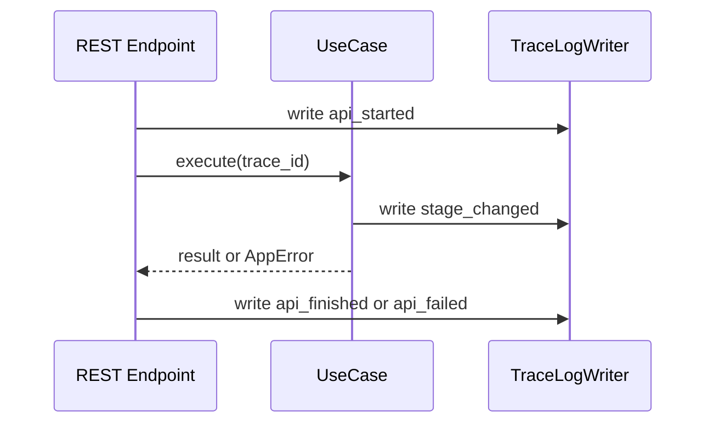

# トレースログIF

## 1. 文書の目的

本書は、`presentation`、`application` と `infrastructure/trace_log` の間で利用する内部IFの契約を定義することを目的とする。

## 2. 前提

- 呼出方式: application portまたはshared tracing経由のメソッド呼出。
- 呼出主体: REST/SSE境界、ユースケース、Codex実行、検証、成果物保存、例外ハンドラ。
- トレースログは障害調査用JSONLであり、利用者へ直接表示しない。

## 3. IF概要

| 項目 | 内容 |
| --- | --- |
| IF名 | トレースログIF |
| 呼出元 | `presentation`、`application` |
| 呼出先 | `TraceLogWriter` |
| 目的 | 全APIで例外を捕捉し、trace_id、エラー分類、処理段階、関連IDを記録する。 |
| 冪等性 | ログ出力は非冪等。同一事象の重複出力は呼出元が抑制する。 |

## 4. 呼出シーケンス

## 5. 事前条件 / 事後条件 / 不変条件

### 5.1. 事前条件

- API境界でtrace_idが生成または受け渡し済みである。
- ログ出力先ディレクトリが設定済みである。

### 5.2. 事後条件

- 正常終了時は開始、主要段階、終了がtrace_idで関連付けて記録される。
- 例外時はエラー分類、利用者向けメッセージ、内部詳細、関連IDが記録される。
- ログ出力失敗は元処理のエラー分類を上書きしない。

### 5.3. 不変条件

- 全APIとSSE接続はtrace_idを持つ。
- 利用者指示本文、回答ブロック本文、ファイルパスなどの長文/機密候補は必要最小限にマスクまたは要約する。
- traceログはJSONL 1行1イベントで出力する。

## 6. 入出力とデータ項目

### 6.1. 入力

| 項目 | 内容 |
| --- | --- |
| `trace_id` | API、ユースケース、ログを関連付けるID |
| `event_name` | `api_started`、`stage_changed`、`api_finished`、`api_failed` など |
| `error_class` | エラー分類 |
| `chat_id` | 関連チャットID |
| `run_id` | 関連run ID |
| `stage` | 実行、検証、保存、配信などの処理段階 |
| `user_id` | 関連利用者ID |
| `exception_type` | 捕捉した例外型名 |
| `stacktrace` | マスク済みスタックトレース |
| `codex_exit_status` | codex execの終了コードと終了理由 |
| `runner_type` | 生成用または検証用のrunner種別 |
| `os_name` | 実行OS名 |
| `process_result` | プロセス終了、終了要求、キャンセル、タイムアウトの結果 |
| `execution_deadline_at` | 実行全体deadline |
| `timeout_state` | 全体deadline超過、codex exec単位タイムアウト、終了待ちgrace timeoutのいずれか |
| `cancel_state` | キャンセル要求受付、終了要求結果、終端整合結果 |
| `retry_count` | 再生成回数 |
| `validation_failure_reason` | 固定検証、参照元検証、参照元PDF読み取り失敗の理由 |
| `validation_comment` | 検証用Codexのcomment要約 |
| `message` | 調査用要約メッセージ |

### 6.2. 出力

| 項目 | 内容 |
| --- | --- |
| `trace_record` | JSONLへ追記された1イベント |
| `write_result` | 書込成功または失敗情報 |

## 7. 例外処理

| 条件 | 扱い |
| --- | --- |
| ログファイル書込失敗 | 標準エラーまたはアプリログへ退避し、元処理のHTTP応答は上書きしない |
| マスク対象項目が含まれる | マスク後の値だけを出力する |
| trace_id未設定 | presentation境界で生成し直し、設定漏れを警告として記録する |

### 7.1. マスク対象

| 対象 | 扱い |
| --- | --- |
| APIキー、トークン、秘密情報 | 値を保存せず固定文字列でマスクする。 |
| 環境変数全文、設定ファイル全文 | 出力せず、必要な設定キー名だけを要約する。 |
| 絶対パス、内部ディレクトリ | 許可された論理名または相対要約へ置換する。 |
| 生JSONL全文、コマンド出力全文 | 保存せず、イベント種別、件数、終了状態だけを要約する。 |
| 利用者指示全文、回答全文、巨大な本文 | 先頭要約と長さだけを保存する。 |

## 8. 留意事項

- 監査ログではなく障害調査ログとして設計する。必要になった場合、監査ログは別IFとして追加する。
