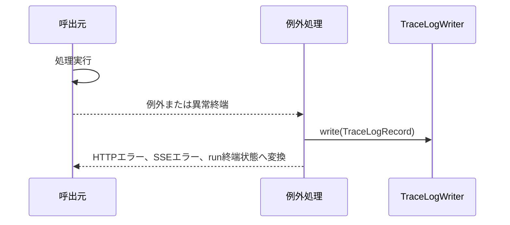

# トレースログIF

## 1. 文書の目的

本書は、`presentation`、`application` と `infrastructure/trace_log` の間で、`application/ports/trace_log/interface.py` を通じて利用する内部IFの契約を定義することを目的とする。

## 2. 前提

- 呼出方式: application port経由のメソッド呼出。
- 呼出主体: REST/SSE例外ハンドラ、チャット実行処理、起動時回復処理、アプリ生成入口。
- トレースログは開発者向けの異常調査ログであり、利用者へ直接表示しない。
- 正常終了、処理開始、処理完了、ユーザキャンセル、検証不合格による通常の再生成は記録しない。

## 3. IF概要

| 項目 | 内容 |
| --- | --- |
| IF名 | トレースログIF |
| 呼出元 | `presentation`、`application` |
| 呼出先 | `src/backend/application/ports/trace_log/interface.py`。具象実装は `TraceLogWriter` |
| 目的 | 異常系発生時に、trace_id、エラー分類、処理段階、関連ID、例外詳細を記録する。 |
| 冪等性 | ログ出力は非冪等。同一事象の重複出力は呼出元が抑制する。 |

### 3.1. Port構成

| Port / DTO | 役割 |
| --- | --- |
| `TraceLoggerPort` | `TraceLogRecord` を受け取り、1異常1YAMLファイルとして保存する。 |
| `TraceLogRecord` | トレースログへ保存する異常調査項目を保持するDTO。 |

## 4. 呼出シーケンス

## 5. 事前条件 / 事後条件 / 不変条件

### 5.1. 事前条件

- API/SSE境界またはチャット実行入口でtrace_idが生成または受け渡し済みである。
- ログ出力先ディレクトリが設定済みである。

### 5.2. 事後条件

- 異常発生時はエラー分類、例外型、スタックトレース、関連ID、処理段階が記録される。
- 最大試行回数まで検証が不合格になった場合は、最後の検証情報だけが記録される。
- ログ出力失敗は元処理のHTTP応答、SSEイベント、run終端状態を上書きしない。

### 5.3. 不変条件

- 全APIとSSE接続はtrace_idを持つ。
- トレースログは1異常1YAMLファイルで出力する。
- トレースログの発生日時、日付ディレクトリ、ファイル名、保存期間判定は `app.timezone` 基準で扱う。
- 開発者向け調査情報はマスクしない。
- 巨大な文字列は上限長で切り詰める。
- 保存期間を過ぎた日付ディレクトリはアプリケーション起動時に削除対象とする。
- アプリケーション起動ごとの同日保存件数が設定上限に達した後は、当日中の追加ログを保存しない。

## 6. 入出力とデータ項目

### 6.1. 入力

| 項目 | 内容 |
| --- | --- |
| `trace_id` | API、ユースケース、ログを関連付けるID |
| `event_name` | `api_failed`、`sse_failed`、`execution_failed`、`execution_timeout`、`validation_retry_limit_reached`、`recovery_failed`、`app_bootstrap_failed` など |
| `stage` | API、SSE、生成、検証、実行、起動時回復、アプリ生成などの処理段階 |
| `error_class` | エラー分類 |
| `exception_type` | 捕捉した例外型名 |
| `stacktrace` | 捕捉した例外のスタックトレース |
| `message` | 調査用メッセージ |
| `chat_id` | 関連チャットID |
| `run_id` | 関連run ID |
| `user_id` | 関連利用者ID |
| `reference_id` | 関連参照元ID |
| `artifact_id` | 関連成果物ID |
| `http_method` | HTTPメソッド |
| `path` | HTTPリクエストパス |
| `status_code` | HTTPステータス |
| `client` | 接続元情報 |
| `request_validation_errors` | リクエストバリデーションエラー詳細 |
| `runner_type` | 生成用または検証用のrunner種別 |
| `codex_exit_status` | codex execの終了状態 |
| `process_result` | プロセス終了、終了要求、タイムアウトなどの結果 |
| `execution_deadline_at` | 実行全体deadline |
| `timeout_state` | 全体deadline超過、codex exec単位タイムアウト、終了待ちgrace timeoutのいずれか |
| `cancel_state` | キャンセル要求との競合状態 |
| `retry_count` | 再生成回数 |
| `validation_failure_reason` | 固定検証、参照元検証、参照元PDF読み取り失敗の理由 |
| `validation_comment` | 最後の検証結果コメント |
| `config_path` | アプリ生成時に利用した設定ファイルパス |
| `recovery_summary` | 起動時回復の失敗概要 |
| `failed_recovery_run_id` | 起動時回復に失敗したrun ID |
| `shutdown_phase` | 終了処理の段階 |

### 6.2. 出力

| 項目 | 内容 |
| --- | --- |
| `trace_record` | `TraceLogRecord` の内容を `<trace_log.dir>/<yyyy-MM-dd>/<HH-mm-ss>_<microseconds>_<event_name>.yaml` に保存した1異常分のYAML。日時部分は `app.timezone` 基準。 |
| `write_result` | 呼出元へは返さない。書込失敗は元処理へ波及させない。 |

### 6.3. 保持設定

| 項目 | 内容 |
| --- | --- |
| `trace_log.retention_days` | トレースログ日付ディレクトリの保持日数。MVP標準は90日。 |
| `trace_log.max_files_per_day` | アプリケーション起動ごとの同日最大保存件数。MVP標準は1000件。 |

## 7. 例外処理

| 条件 | 扱い |
| --- | --- |
| ログファイル書込失敗 | 元処理のHTTP応答、SSEイベント、run終端状態を上書きせず処理を継続する |
| 期限超過ログ削除失敗 | 起動処理を止めず、削除できた範囲だけを反映する |
| 同日上限到達 | 当日中の追加ログを保存せず、呼出元へ例外を返さない |
| trace_id未設定 | presentation境界または呼出元で生成してから記録する |
| 同一ファイル名の衝突 | ファイル名末尾へ連番を付け、既存ファイルを上書きしない |
| 巨大な文字列 | `message`、`validation_comment`、`request_validation_errors` などは64KiB、`stacktrace` は1MiBを上限に切り詰める |

## 8. 留意事項

- 監査ログではなく障害調査ログとして設計する。必要になった場合、監査ログは別IFとして追加する。
- `SIGKILL`、OS強制終了、Pythonプロセスクラッシュ、ASGIサーバ外で完結する通信断は捕捉対象外とする。
