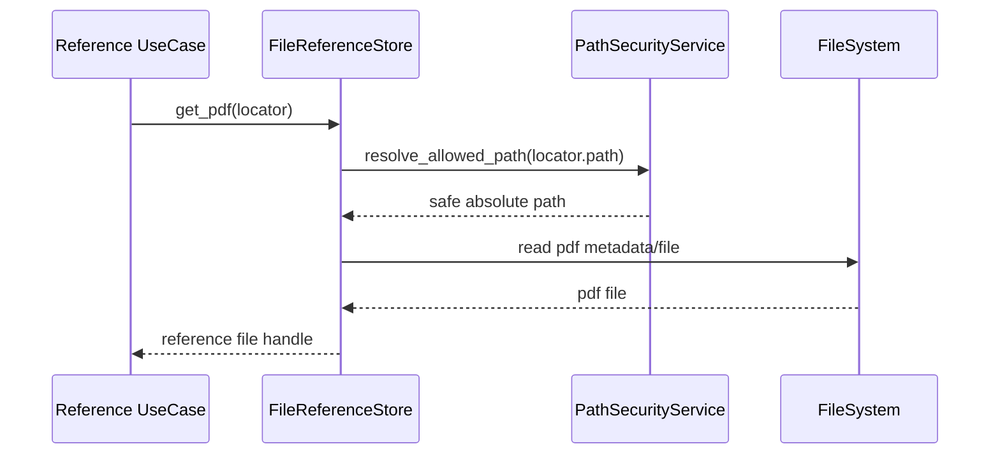

# 参照元ファイルIF

## 1. 文書の目的

本書は、`application/references`、`application/validation` と `infrastructure/filesystem/references` の間で利用する内部IFの契約を定義することを目的とする。

## 2. 前提

- 呼出方式: Pythonメソッド呼出。
- 呼出主体: `GetReferenceDataUseCase`、`ValidateAnswerUseCase`。
- MVPの参照元種別はPDFのみとする。
- DBおよび内部IFで扱う `locator.path` は共有データソースルートからの相対パスであり、Codex作業領域上の `readonly/` 接頭辞は含めない。

## 3. IF概要

| 項目 | 内容 |
| --- | --- |
| IF名 | 参照元ファイルIF |
| 呼出元 | 参照元取得、参照元検証ユースケース |
| 呼出先 | `FileReferenceStore`、`PathSecurityService` |
| 目的 | 参照元IDまたはlocatorから、許可範囲内のPDFファイルだけを取得する。 |
| 冪等性 | 同一参照元と同一ファイル状態に対する取得は冪等。 |

## 4. 呼出シーケンス

## 5. 事前条件 / 事後条件 / 不変条件

### 5.1. 事前条件

- 参照元の相対パスとページ範囲が保存済み回答または検証対象回答から取得できる。
- 共有データソースのルートディレクトリが設定済みである。
- ページ番号は1以上である。

### 5.2. 事後条件

- 許可範囲内のPDFファイル参照だけが返る。
- 検証時は、許可範囲内のPDFファイルが存在し、読み取り可能で、指定ページ範囲が実PDFのページ数内に収まることを判定できる。
- 参照元取得APIへ渡す配信用情報は、実ファイルパスではなく内部IDまたは安全なURLへ変換できる。

### 5.3. 不変条件

- 共有データソース外のパスは常に拒否する。
- `locator.path` は共有データソースルートからの相対PDFパスだけを受け付け、絶対パス、親ディレクトリ参照、PDF以外の拡張子を拒否する。
- 参照元ファイル実体の絶対パスを画面へ返さない。
- PDF以外の参照元種別はMVPの表示対象に含めない。

## 6. 入出力とデータ項目

### 6.1. 入力

| 項目 | 内容 |
| --- | --- |
| `reference_id` | 保存済み参照元ID |
| `locator.path` | 共有データソースルートからのPDF相対パス |
| `locator.page_start` | 開始ページ |
| `locator.page_end` | 終了ページ |

### 6.2. 出力

| 項目 | 内容 |
| --- | --- |
| `safe_path` | 許可範囲内と確認済みの内部パス |
| `pdf_stream` | 配信用PDF内容 |
| `display_reference` | 画面表示用ラベル、URL、ページ範囲 |

## 7. 例外処理

| 条件 | 扱い |
| --- | --- |
| 参照元IDが存在しない | 対象なし分類の `AppError` を返す |
| PDFファイルが存在しない | 参照元取得失敗として `AppError` を返す |
| パストラバーサル検知 | セキュリティエラー分類の `AppError` を返し、traceログへ記録する |
| PDFファイルを読み取れない | 検証時はデータソース準備側のシステムエラーとして扱い、参照元取得時は参照元取得失敗として扱う |
| ページ範囲不正 | 検証失敗または入力不正分類として扱う |

## 8. 留意事項

- PDFページ数の厳密な検証は、回答候補の参照元検証で検証用codex execを起動する前に実施する。参照元取得時は保存済みlocatorを信頼しつつ、読込失敗を安全に扱う。
