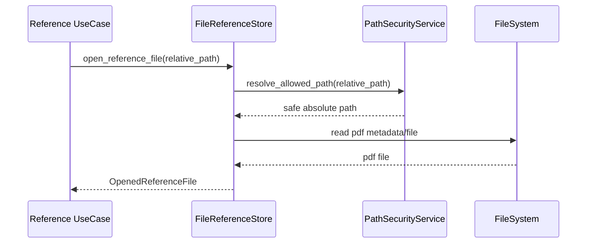

# 参照元ファイルIF

## 1. 文書の目的

本書は、`application/references` と `infrastructure/filesystem/file_reference_store.py` の間で、`application/ports/filesystem/interface.py` を通じて利用する内部IFの契約を定義することを目的とする。

## 2. 前提

- 呼出方式: Pythonメソッド呼出。
- 呼出主体: `GetReferenceDataUseCase`。
- 本システムの参照元種別はPDFのみとする。
- DBおよび内部IFで扱う `locator.path` は共有データソースルートからの相対パスであり、Codex作業領域上の `data_source/` 接頭辞は含めない。

## 3. IF概要

| 項目 | 内容 |
| --- | --- |
| IF名 | 参照元ファイルIF |
| 呼出元 | 参照元取得ユースケース |
| 呼出先 | `src/backend/application/ports/filesystem/interface.py`。具象実装は `FileReferenceStore`、`PathSecurityService` |
| 目的 | 保存済み参照元メタ情報から、許可範囲内のPDFファイルだけを取得する。 |
| 冪等性 | 同一参照元と同一ファイル状態に対する取得は冪等。 |

### 3.1. Port構成

| Port | 役割 |
| --- | --- |
| `ReferenceStorePort` | 保存済み参照元の共有データソース相対パスを安全な実PDFファイルパスへ解決し、配信用に開く。 |

## 4. 呼出シーケンス

## 5. 事前条件 / 事後条件 / 不変条件

### 5.1. 事前条件

- 参照元の相対パスが保存済み回答から取得できる。
- 共有データソースのルートディレクトリが設定済みである。

### 5.2. 事後条件

- 許可範囲内のPDFファイル参照だけが返る。
- 許可範囲内のPDFファイルが存在し、読み取り可能であることを判定できる。
- 参照元取得APIへ渡す配信用情報は、実ファイルパスではなく内部IDまたは安全なURLへ変換できる。

### 5.3. 不変条件

- 共有データソース外のパスは常に拒否する。
- `locator.path` は共有データソースルートからの相対PDFパスだけを受け付け、絶対パス、親ディレクトリ参照、PDF以外の拡張子を拒否する。
- 参照元ファイル実体の絶対パスを画面へ返さない。
- PDF以外の参照元種別は本システムの表示対象に含めない。

## 6. 入出力とデータ項目

### 6.1. 入力

| 項目 | 内容 |
| --- | --- |
| `reference_id` | 保存済み参照元ID |
| `relative_path` | 共有データソースルートからのPDF相対パス |

### 6.2. 出力

| 項目 | 内容 |
| --- | --- |
| `OpenedReferenceFile` | 許可範囲内と確認済みの配信用PDFファイルパスとMIMEタイプ |

## 7. 例外処理

| 条件 | 扱い |
| --- | --- |
| 参照元IDが存在しない | 対象なし分類の `AppError` を返す |
| PDFファイルが存在しない | 参照元取得失敗として `AppError` を返す |
| パストラバーサル検知 | 表示不可分類の `AppError` を返す。通常の入力拒否として扱い、共通ハンドラではトレースログへ記録しない |
| PDFファイルを読み取れない | 参照元取得失敗として扱う |
| ページ範囲不正 | 保存済み回答の参照元取得ではDB上のlocatorを信頼する。回答候補検証ではCodex検証処理前の確認で扱う |

## 8. 留意事項

- PDF存在確認とページ数の厳密な検証は、回答候補のCodex検証処理前に、固定検証処理として実施する。本IFは保存済み参照元の配信用読込を扱う。
