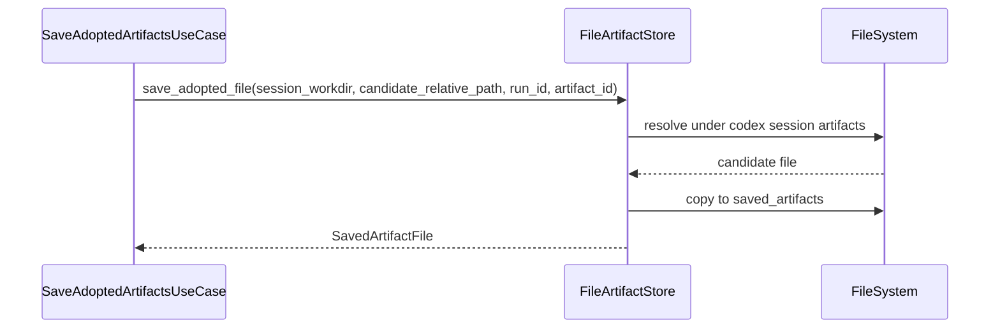

# 成果物ファイルIF

## 1. 文書の目的

本書は、`application/artifacts` と `infrastructure/filesystem/file_artifact_store.py` の間で、`application/ports/filesystem/interface.py` を通じて利用する内部IFの契約を定義することを目的とする。

## 2. 前提

- 呼出方式: Pythonメソッド呼出。
- 呼出主体: `SaveAdoptedArtifactsUseCase`、`GetArtifactUseCase`、`ExecuteChatDeletionUseCase`、`ExecuteAccountDeletionUseCase`。
- 本IFはCodex作業領域内の成果物候補と、保存済み成果物領域を分離して扱う。
- セッション内 `artifacts/` は採用前の一時領域であり、履歴表示やブラウザ配信では直接参照しない。
- 回答本文内の成果物リンクは固定検証処理で `artifacts/...` または `./artifacts/...` 形式に限定される。

## 3. IF概要

| 項目 | 内容 |
| --- | --- |
| IF名 | 成果物ファイルIF |
| 呼出元 | 成果物保存、成果物配信、チャット物理削除、アカウント物理削除ユースケース |
| 呼出先 | `src/backend/application/ports/filesystem/interface.py`。具象実装は `FileArtifactStore` |
| 目的 | 許可されたCodex成果物だけを採用済み領域へ保存し、配信時に安全に読み込み、チャット削除またはアカウント削除時に対象成果物実体を削除する。 |
| 冪等性 | 同一artifact IDへの保存は重複不可。配信用読込は冪等。削除対象ファイルまたはユーザディレクトリが存在しない場合は削除済みとして扱う。 |

### 3.1. Port構成

| Port | 役割 |
| --- | --- |
| `AdoptedArtifactStorePort` | 採用済み回答が参照したCodex成果物候補を保存済み成果物領域へコピーする。 |
| `ArtifactStorePort` | `AdoptedArtifactStorePort` の保存責務に加え、保存済み成果物を配信用に開く。 |
| `SavedArtifactDeletionPort` | DBに保存された `storage_path` をもとに保存済み成果物実体を削除し、アカウント物理削除時はユーザ単位の保存済み成果物ディレクトリを削除する。 |

## 4. 呼出シーケンス

## 5. 事前条件 / 事後条件 / 不変条件

### 5.1. 事前条件

- 回答ブロック本文で参照された成果物候補パスがCodex作業領域からの相対パスである。
- 成果物候補パスは対象セッションの `artifacts/` 配下を指している。
- 成果物候補の拡張子は `.svg`、`.png`、`.jpg`、`.jpeg`、`.html`、`.csv` のいずれかである。
- 保存先session_idとartifact IDが確定済みである。
- 許可するMIMEタイプと拡張子が設定済みである。

### 5.2. 事後条件

- 検証済み成果物だけが保存済み成果物領域へコピーされる。
- 保存済み成果物の配信用URLへ置換できる保存参照が返る。
- 配信時は保存済み成果物領域内の実体だけを読み込む。
- 回答ブロック本文へ保存する成果物URLは `/api/artifacts/{artifact_id}` 形式になる。
- チャット物理削除時は、対象チャットに紐づく保存済み成果物実体が削除され、空になった親セッションディレクトリも削除される。
- アカウント物理削除時は、対象ユーザの保存済み成果物ディレクトリが削除される。

### 5.3. 不変条件

- `artifacts\...` と `./artifacts\...` の区切り文字差分は `artifacts/...` へ標準化し、絶対パス、UNC、URL、親ディレクトリ参照、許可外拡張子は拒否する。
- Codex作業領域のファイルを直接ブラウザへ配信しない。
- 成果物保存は回答採用後の参照済みファイルに限定する。
- 失敗、再生成前候補、キャンセル、タイムアウトの成果物候補は保存済み成果物領域へコピーしない。
- 共有データソース配下のファイルはCodex成果物として扱わない。
- チャット物理削除時の保存済み成果物削除は `generator.saved_artifacts_dir` 配下へ正規化できる `storage_path` だけを対象にする。
- アカウント物理削除時の保存済み成果物削除は `generator.saved_artifacts_dir/<user-id>` ディレクトリだけを対象にする。
- 保存済み成果物削除は `generator.saved_artifacts_dir` 自体、他ユーザのディレクトリ、他セッションのディレクトリを削除しない。

## 6. 入出力とデータ項目

### 6.1. 入力

| 項目 | 内容 |
| --- | --- |
| `session_workdir` | Codexセッション作業領域 |
| `candidate_relative_path` | Codex作業領域からの成果物候補相対パス |
| `session_id` | 保存先session_id |
| `artifact_id` | 保存済み成果物ID |
| `relative_path` | 保存済み成果物領域からの相対パス。読込時に使用する |
| `storage_paths` | 削除対象の保存済み成果物相対パス一覧 |
| `user_id` | アカウント物理削除で削除対象にするユーザID |

### 6.2. 出力

| 項目 | 内容 |
| --- | --- |
| `SavedArtifactFile` | 保存先相対参照、MIMEタイプ |
| `OpenedArtifactFile` | 配信用ファイルパスとMIMEタイプ |
| `deleted_paths` | 削除済みとして扱った保存済み成果物相対パス一覧 |
| `deleted_user_artifacts_dir` | アカウント物理削除で削除済みとして扱ったユーザ単位の保存済み成果物ディレクトリ |

### 6.3. パス検証対象

| 対象 | 検証ルール |
| --- | --- |
| 成果物候補 | 対象セッションの `artifacts/` 配下へ正規化できる相対パスだけを許可する。 |
| 保存済み成果物 | `generator.saved_artifacts_dir/<user-id>/<session_id>/<artifact_id>.<拡張子>` 配下へ正規化できる保存参照だけを許可する。 |
| ユーザ単位保存済み成果物 | `generator.saved_artifacts_dir/<user-id>` 配下へ正規化できるディレクトリだけをアカウント物理削除対象にする。 |
| 共有データソース | 参照元として扱い、Codex成果物保存対象にはしない。 |

### 6.4. 許可拡張子とMIMEタイプ

| 拡張子 | MIMEタイプ | 用途 |
| --- | --- | --- |
| `.svg` | `image/svg+xml` | 画像表示または通常リンク |
| `.png` | `image/png` | 画像表示または通常リンク |
| `.jpg` | `image/jpeg` | 画像表示または通常リンク |
| `.jpeg` | `image/jpeg` | 画像表示または通常リンク |
| `.html` | `text/html` | 通常リンク |
| `.csv` | `text/csv` | 通常リンク |

## 7. 例外処理

| 条件 | 扱い |
| --- | --- |
| 候補ファイルが存在しない | 成果物なしとして回答採用を失敗させる |
| パストラバーサル検知 | 表示不可分類の `AppError` とする。通常の入力拒否として扱い、共通ハンドラではトレースログへ記録しない |
| 許可外MIMEタイプ | 採用対象から除外し、必要に応じて検証失敗にする |
| 保存失敗 | `ErrorType.SYSTEM` かつ `trace=True` の `AppError` として上位へ返し、DB保存はcommitしない |
| 削除対象ファイルが存在しない | 冪等な削除済みとして扱う |
| 保存済み成果物削除時のパストラバーサル検知 | `ErrorType.SYSTEM` かつ `trace=True` の `AppError` とし、DB削除へ進まない |
| 保存済み成果物削除失敗 | `ErrorType.SYSTEM` かつ `trace=True` の `AppError` として上位へ返し、対象チャットは`deleting`のまま維持する |
| ユーザ単位保存済み成果物削除失敗 | `ErrorType.SYSTEM` かつ `trace=True` の `AppError` として上位へ返し、対象ユーザは`deleting`のまま維持する |

## 8. 留意事項

- 回答ブロック本文内の成果物URL置換はapplication層が行い、ファイルコピーは本IFが行う。
- 回答本文内の成果物リンク形式、拡張子、実ファイル存在の固定検証処理はapplication層の成果物リンク検証で行い、本IFは保存と配信用読込のファイル操作に集中する。
