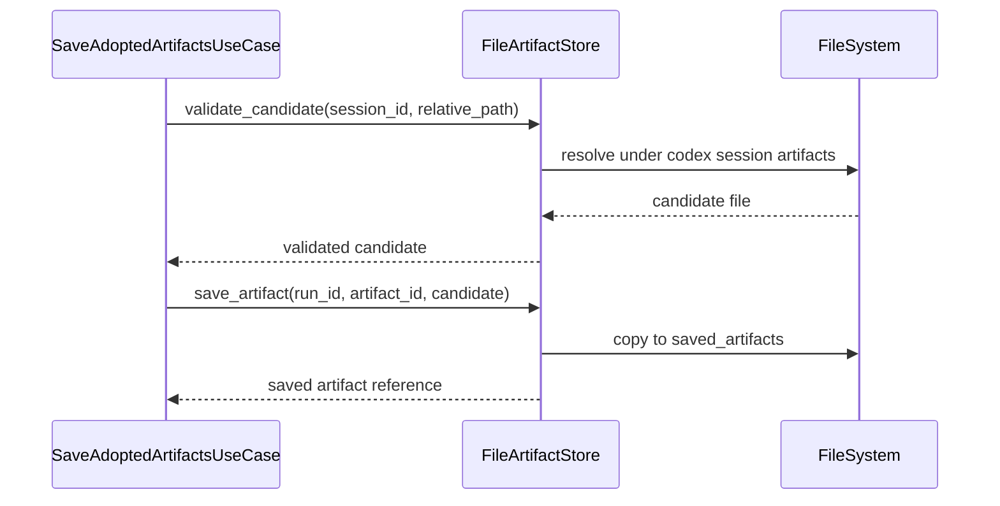

# 成果物ファイルIF

## 1. 文書の目的

本書は、`application/artifacts`、`application/validation` と `infrastructure/filesystem/artifacts` の間で利用する内部IFの契約を定義することを目的とする。

## 2. 前提

- 呼出方式: Pythonメソッド呼出。
- 呼出主体: `SaveAdoptedArtifactsUseCase`、`ValidateAnswerUseCase`、`GetArtifactUseCase`。
- 本IFはCodex作業領域内の成果物候補と、保存済み成果物領域を分離して扱う。
- セッション内 `artifacts/` は採用前の一時領域であり、履歴表示やブラウザ配信では直接参照しない。

## 3. IF概要

| 項目 | 内容 |
| --- | --- |
| IF名 | 成果物ファイルIF |
| 呼出元 | 成果物保存、検証、成果物配信ユースケース |
| 呼出先 | `FileArtifactStore` |
| 目的 | 許可されたCodex成果物だけを採用済み領域へ保存し、配信時に安全に読み込む。 |
| 冪等性 | 同一artifact IDへの保存は重複不可。配信用読込は冪等。 |

## 4. 呼出シーケンス

## 5. 事前条件 / 事後条件 / 不変条件

### 5.1. 事前条件

- 回答本文で参照された成果物候補パスがCodex作業領域からの相対パスである。
- 成果物候補パスは対象セッションの `artifacts/` 配下を指している。
- 保存先run IDとartifact IDが採番済みである。
- 許可するMIMEタイプと拡張子が設定済みである。

### 5.2. 事後条件

- 検証済み成果物だけが保存済み成果物領域へコピーされる。
- 保存済み成果物の配信用URLへ置換できる保存参照が返る。
- 配信時は保存済み成果物領域内の実体だけを読み込む。
- 回答Markdownへ保存する成果物URLは `/api/artifacts/{artifact_id}` 形式になる。

### 5.3. 不変条件

- 絶対パス、親ディレクトリ参照、許可外拡張子は拒否する。
- Codex作業領域のファイルを直接ブラウザへ配信しない。
- 成果物保存は回答採用後の参照済みファイルに限定する。
- 失敗、再生成前候補、キャンセル、タイムアウトの成果物候補は保存済み成果物領域へコピーしない。
- 共有データソース配下のファイルはCodex成果物として扱わない。

## 6. 入出力とデータ項目

### 6.1. 入力

| 項目 | 内容 |
| --- | --- |
| `session_id` | Codex作業領域を特定する内部ID |
| `candidate_relative_path` | Codex作業領域からの成果物候補相対パス |
| `run_id` | 保存先run ID |
| `artifact_id` | 保存済み成果物ID |
| `allowed_mime_types` | 配信を許可するMIMEタイプ一覧 |

### 6.2. 出力

| 項目 | 内容 |
| --- | --- |
| `validated_candidate` | 安全確認済みの成果物候補 |
| `saved_artifact_reference` | 保存先相対参照、MIMEタイプ、サイズ |
| `artifact_stream` | 配信用ファイル内容とMIMEタイプ |

### 6.3. パス検証対象

| 対象 | 検証ルール |
| --- | --- |
| 成果物候補 | 対象セッションの `artifacts/` 配下へ正規化できる相対パスだけを許可する。 |
| 保存済み成果物 | `codex.saved_artifacts_dir/<run_id>/<artifact_id>.<拡張子>` 配下へ正規化できる保存参照だけを許可する。 |
| 共有データソース | 参照元として扱い、Codex成果物保存対象にはしない。 |

## 7. 例外処理

| 条件 | 扱い |
| --- | --- |
| 候補ファイルが存在しない | 成果物なしとして回答採用を失敗させる |
| パストラバーサル検知 | セキュリティエラー分類の `AppError` とし、traceログへ記録する |
| 許可外MIMEタイプ | 採用対象から除外し、必要に応じて検証失敗にする |
| 保存失敗 | ファイルIOエラーとして上位へ返し、DB保存はcommitしない |

## 8. 留意事項

- 回答本文内の成果物URL置換はapplication層が行い、ファイルコピーは本IFが行う。
