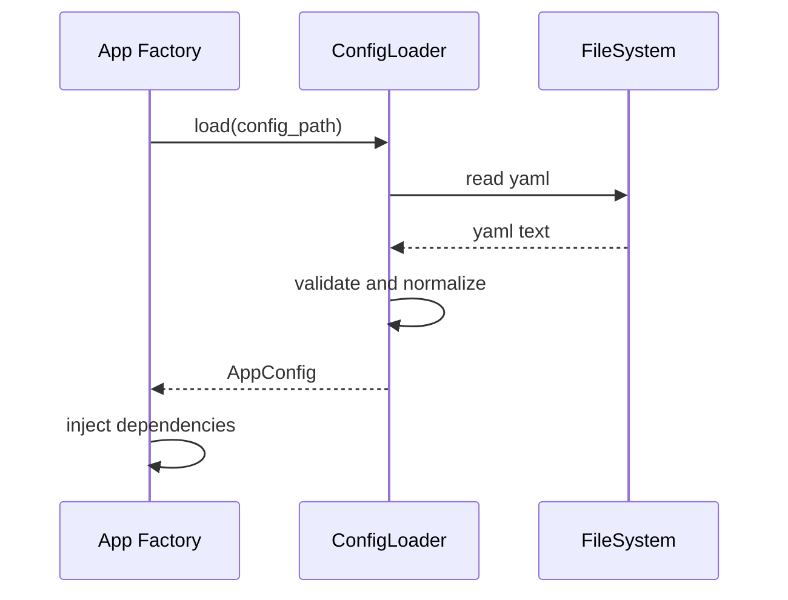

# 設定読込IF

## 1. 文書の目的

本書は、`app`、`presentation`、`application`、`infrastructure` と `infrastructure/config` の間で利用する内部IFの契約を定義することを目的とする。

## 2. 前提

- 呼出方式: アプリ起動時の設定読込と、DI時の設定オブジェクト参照。
- 呼出主体: FastAPIアプリ組み立て、各ユースケース、infrastructure実装。
- 設定ファイル項目そのものの外部仕様は `docs/02_外部設計/06_外部インターフェース設計/設定ファイル IF.md` を正とする。
- `server.timeout_seconds` は回答生成開始から検証完了までの実行全体deadlineを決める値として読み込み、CodexRunnerへ直接固定値として渡さない。

## 3. IF概要

| 項目 | 内容 |
| --- | --- |
| IF名 | 設定読込IF |
| 呼出元 | `app`、`presentation`、`application`、`infrastructure` |
| 呼出先 | `ConfigLoader` |
| 目的 | YAML設定を型付き設定へ変換し、必須項目、パス、数値範囲を起動前に検証する。 |
| 冪等性 | 同一設定ファイルに対する読込と検証は冪等。 |

## 4. 呼出シーケンス

## 5. 事前条件 / 事後条件 / 不変条件

### 5.1. 事前条件

- 設定ファイルパスがアプリ起動時に決定している。
- YAMLを読み取れる権限がある。

### 5.2. 事後条件

- 必須項目と数値範囲が検証済みの設定オブジェクトが返る。
- ファイルパス設定は正規化され、許可範囲判定へ渡せる形式になる。
- 設定不備はアプリ起動前に検知できる。

### 5.3. 不変条件

- application層は生YAMLやdictを直接参照しない。
- パス設定は文字列連結ではなく、正規化済みPathとして扱う。
- 機密情報を画面、SSE、利用者向けエラーへそのまま出力しない。
- `server.timeout_seconds` は外部設定として1項目のまま保持し、内部では `ExecuteChatRunUseCase` が `execution_deadline_at` と各codex execへの残り秒数へ分解する。

## 6. 入出力とデータ項目

### 6.1. 入力

| 項目 | 内容 |
| --- | --- |
| `config_path` | 読込対象設定ファイルパス |
| `environment` | 必要に応じた実行環境名 |

### 6.2. 出力

| 項目 | 内容 |
| --- | --- |
| `AppConfig` | アプリ表示設定、DB、Codex、ファイル、ログ、タイムアウトなどの型付き設定 |
| `normalized_paths` | 共有データソース、Codex作業領域、成果物保存先、トレースログ出力先 |
| `trace_log.retention_days` | トレースログ日付ディレクトリの保持日数 |
| `trace_log.max_files_per_day` | アプリケーション起動ごとの同日トレースログ最大保存件数 |

### 6.3. タイムアウト設定の扱い

| 項目 | 内容 |
| --- | --- |
| `server.timeout_seconds` | 回答生成から検証完了までの実行全体上限秒数。`ExecuteChatRunUseCase` が `実行中` 遷移時に `execution_deadline_at` を計算する。 |
| codex exec単位の `timeout_seconds` | `execution_deadline_at` から現在時刻を引いた残り秒数。生成用/検証用codex exec起動ごとに算出する。 |
| 終了要求後のgrace timeout | CodexRunner内部の短い固定値として扱い、外部設定項目にはしない。 |

## 7. 例外処理

| 条件 | 扱い |
| --- | --- |
| 設定ファイルが存在しない | 設定不備分類の `AppError` として起動を失敗させる |
| YAML構文不正 | 設定不備分類の `AppError` として起動を失敗させる |
| 必須項目欠落 | 欠落項目名を含む設定不備エラーとして扱う |
| パスが許可外または作成不可 | 設定不備エラーとして扱う |

## 8. 留意事項

- 設定オブジェクトは広い `dict` ではなく、意味のある型で表す。
